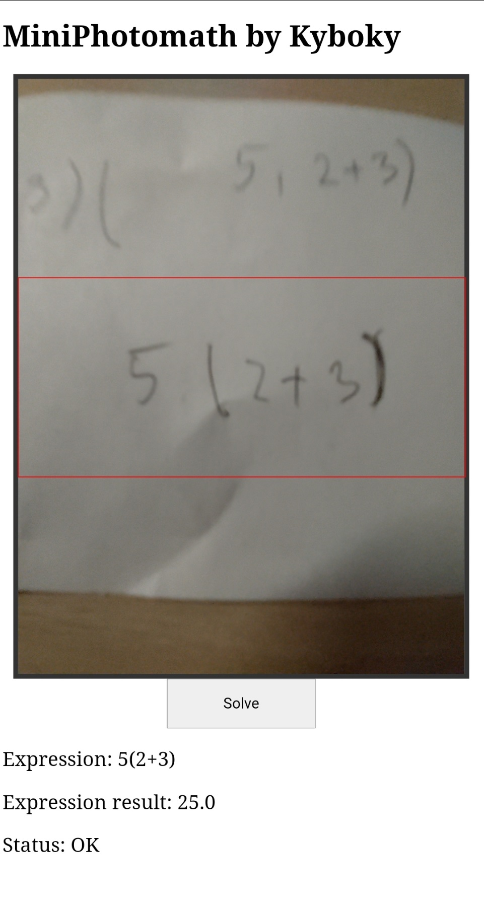

# MiniPhotomath

## How to use
### Docker building and starting image
1. Build a docker image from git repository 
```sh
docker build https://github.com/Kyboky/MiniPhotomath.git -t miniphotomath
```
2. Create docker container with an image
    
    - in case of using other port and not https default port change 443 in wanted port number
```sh
docker container create --name miniphotomath_container --publish 443:5000 miniphotomath
```
	
3. Starting a docker container

```sh
docker container start miniphotomath_container
```
#
### Accessing web interface
1. Open browser and go to 

```sh
https://[host-pc ip]
```  
- in case of changing port number in creating container it is mandatory to add post number as 
  
```sh
https://[host-pc ip]:[port number]
```
#
### Web user interface
User interface
1. Live camera feed

    - To capture and evaluate expression you have to hold it in a red rectangle and click solve
2. On bottom there are:
    
    - Expression - Expression read by python 
    - Expression result - Expression evaluated by script
    - Status
    
        - Ok
        - Computing
        - Error status
    



	
